# PostgreSQL
## 本地連接 PostgreSQL
```shell
psql postgres
```
## 查看資料庫版本
```sql
select version();
```
## Server 啟動時間與換算成已開機時間
```sql
select pg_postmaster_start_time();
```
output
```
+-------------------------------+
|   pg_postmaster_start_time    |
+-------------------------------+
| 2020-10-27 22:37:35.747442+08 |
+-------------------------------+
```

回傳帶時區精準度較高的格式，可以利用函數 `date_trunc` 取到秒
```sql
select date_trunc('second', current_timestamp - pg_postmaster_start_time()) as uptime;
```
output
```
+--------------------------+
|          uptime          |
+--------------------------+
| @ 1 hour 54 mins 32 secs |
+--------------------------+
```
## 列出Server上的Database
```sql
select datname as db_name
  from pg_database
 where datname 
   not in ('postgres', 'template0', 'template1')
    -- 屏蔽系統資料庫,與系統模板資料庫
 order by datname;
```
output
```
   db_name
-------------
 Training
 api
 bookstore
 eCommerce
 tours
 transport
 tsungyuchen
(7 rows)
```

## 查看資料庫大小
```sql
SELECT pg_size_pretty(
       pg_database_size(
       current_database()));
```
output
```
pg_size_pretty
----------------
 8097 kB
```
###  一起查看資料庫大小&名稱
```sql
select datname as db_name
     , pg_size_pretty(
       pg_database_size(
       datname)) as db_size
  from pg_database
 where datname 
   not in ('postgres', 'template0', 'template1')
 order by datname;
```
## 列出設定檔位置
```sql
show config_file;
```
### 列出目前設定情況不是default的
```sql
select name
     , source
     , setting
  from pg_settings
 where source != 'default'
   and source != 'override'
 order by 2, 1;
```
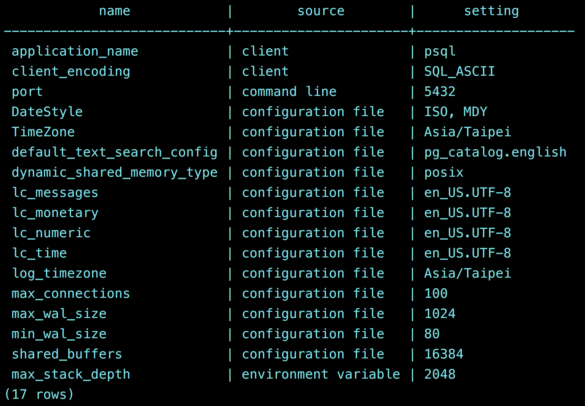

## 檔案匯入DB
運用 `COPY` 指令 — 在檔案和資料表之間複製資料;
`delimiter`: 指定用於分隔檔案每行內欄位的字元。預設值為 `text` 格式的 `tab` 字元，`CSV` 格式的逗號。
### CSV
```sql
copy customer_table from '/Users/tsungyuchen/Desktop/programming/SQL_Bootcamp/sql_master_course/Data/copy.csv' delimiter ',' csv header;
```
成功匯入所回傳的訊息
### TXT
```sql
copy customer_table from '/Users/tsungyuchen/Desktop/programming/SQL_Bootcamp/sql_master_course/Data/copytext.txt' delimiter ',';
```
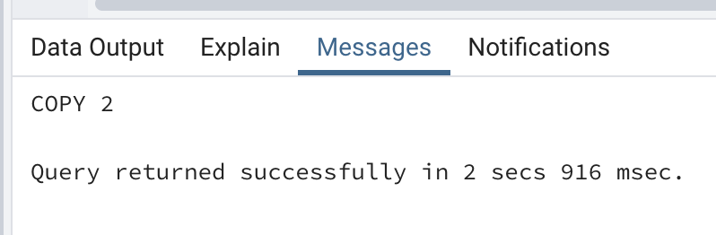

更多用法參考[官方文件](https://docs.postgresql.tw/reference/sql-commands/copy)

## 查詢(Select)
見[select.sql](./select.sql)

### Distinct
一張資料表中某欄位中可能會有多筆重複的資料，透過 ` SELECT` 查詢語法可用 `DISTINCT` 關鍵字過濾重複出現的值，見[select.sql](./select.sql) 的 **2.1** 範例。

> 注意:
> 如果 `SELECT DISTINCT` 後面有指定兩個以上的欄位(column)，則要符合**所有欄位值皆**重複的情形，該筆資料才會被捨棄。若只有其中一個欄位值相同但其它欄位值並不同，該筆資料仍會被取出

### Where
作為條件判斷，取出符合條件的值
範例見[where.sql](./where.sql) 1.1 ~ 1.3

### Logical Operator: 
適當搭配邏輯運算子`(AND & OR & NOT)`，可達成多個條件的查詢
- `AND` 表示該左右兩邊的條件皆需符合才成立
- `OR` 表示該左右兩邊的條件至少需符合一個才成立

範例見[where.sql](./where.sql) 2.1 ~ 2.4

### IN
限制必需符合**某些欄位值為條件**來搜尋資料表中的特定資料
範例見[where.sql](./where.sql) 3.1 ~ 2.4

### BETWEEN
限定某範圍內連續的值作為條件來搜尋資料表中的特定資料，可將範例[where.sql](./where.sql) 2.1 用`BETWEEN` 來進行改寫。

範例見[where.sql](./where.sql) 4.1~4.2。
除了以數值篩選之外，也可以用日期為篩選條件
範例見[where.sql](./where.sql) 4.3。[資料源](./Data/Sales.csv)

### LIKE 
模糊查詢，可依循**特定的規則**來搜尋資料表中的特定資料。
**特定的規則**如: 萬用字元 (SQL Wildcards)，利用萬用字元來建立一個模式 (pattern)。 [PostgreSQL 官方文件](https://docs.postgresql.tw/the-sql-language/functions-and-operators/pattern-matching#9-7-1-like)提供相當多的資訊。

範例見[where.sql](./where.sql) 5.1：找出名字為 **A開頭** 的客戶。[資料源](./Data/Customer.csv)

範例見[where.sql](./where.sql) 5.2：找出名字為 **Alan** 的客戶。

範例見[where.sql](./where.sql) 5.3：找出名字為四個字，姓氏不拘的客戶

| 萬用字元 | 解釋 | 範例
| -------- | -------- | -------- | 
| `%`    | 匹配零～多個字元 | `A%` 表A開頭的字串都符合這個規則; e.g. ABC、AABCC; `%A` 表A結尾的字串; `B%A` 表 B 開頭 A 結尾的字串 |  
|  `_`  | 匹配一個字元 |  `AB_C` 表 AB 開頭 | 
| [charlist]     | 匹配「一個」在列舉範圍內的字元  |  待補 |
| [^charlist] 或 [!charlist]	     | 匹配「一個」不在列舉範圍內的字元  |   待補 | 

### ORDER BY
將取得的資料集依某個欄位來作排序，排序方法可分為: **由小到大 (ascending  又做 ASC; 預設)** ; 或 **由大到小 (descending; 又做 DESC)**

#### 語法結構
- 依照單一欄位排序
```sql
select <column_name> from <table_name> [where <condition>] ORDER BY <column_name> [ASC, DESC];
```
範例見[where.sql](./where.sql) 6.1：找出 state 為 California 的所有客戶，並依照 **升冪(ASC)** 排列

範例見[where.sql](./where.sql) 6.2：找出 state 為 California 的所有客戶，並依照 **降冪(DESC)** 排列

- 依照多個(兩個以上)欄位排序
```sql
select <column_name> from <table_name> [where <condition>] ORDER BY <column_name1> [ASC, DESC] , <column_name2> [ASC, DESC];
```
範例見[where.sql](./where.sql) 6.3：city 依照 **升冪(ASC)** customer_name 依照 **降冪(DESC)** 排列，找出所有客戶

- 依照數值排列，前面提的數值用來表示欄位在資料表中的順序，如: 2 表示 **第二個欄位** 
範例見[where.sql](./where.sql) 6.4：依照資料表中的第二個欄位做 **降冪(DESC)** 排列，找出所有客戶。

### LIMIT 
限制 SQL 語句影響的資料筆數
範例見[where.sql](./where.sql) 7.1：查詢年齡大於30歲，且依照age 降冪排列，只取前10筆

### AS (Alias)
替資料表或欄位名稱取一個別名 (Alias)，好處是可將名稱複雜的SQL 語句調整成較為簡潔易讀的形式
#### 語法結構
```sql
select <column_name> AS <column_alias> from <table_name>
```
範例見[where.sql](./where.sql) 8.1，回傳結果:
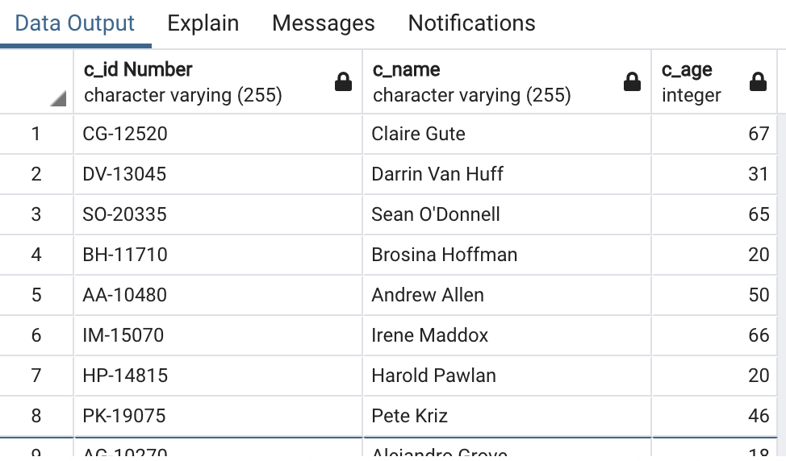

## Update
`update` 語句用於修改資料表中的資料
範例見[update.sql](./update.sql) 1.1 ~ 1.2
## Delete
`delete` 語句用於刪除資料表中的資料
範例見[delete.sql](./delete.sql) 1.1 ~ 1.3

## ALTER
`ALTER`  用來修改**已存在**的資料表（Table）結構
語句型式：
```sql
ALTER TABLE table_name  <<Spacific Action>> ;
```
`<<Spacific Action>>`的地方不同的對象，可以有以下操作行為：
- Columns：Add、Delete (Drop) 、Modify、Rename
- Constraints：Add、Delete (Drop)
- Index：Add、Delete (Drop)

### Columns
- 新增資料欄位 (Column) ，語法結構:
```sql
ALTER TABLE table_name ADD <column_name> <data_type> ;
```
其中`<column_name>` 替換成資料欄位名稱;  `<data_type>` 替換成該資料欄位的屬性
[範例1.1](./alter_table.sql) : 新增名為 test_col 的欄位名稱，欄位屬性為`varchar`，長度限制為255
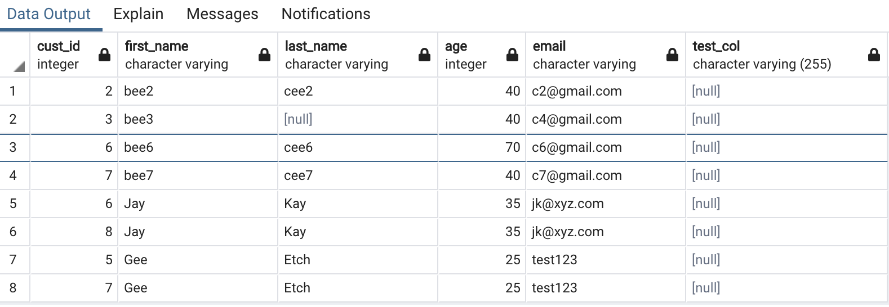

- 刪除資料欄位 (Column) ，語法結構:
```sql
ALTER TABLE table_name DROP column <column_name>;
```
[範例1.2](./alter_table.sql)：刪除名為 test_col 的欄位名稱 
- 修改欄位資料型別
```sql
ALTER TABLE table_name ALTER COLUMN <column_name> TYPE <datatype>;
```
[範例1.3](./alter_table.sql)：修改 age 欄位的資料型別為 `varchar`
[範例1.4](./alter_table.sql)：修改 age 欄位的資料型回 `integer`
- 修改欄位名稱
```sql
ALTER TABLE table_name RENAME COLUMN <column_name_old> TO <column_name_new>;
```
[範例1.5](./alter_table.sql)：對欄位名稱  `email` 重新命名為 `customer_email`

### Constraint
有條件地限制哪些資料才能被存入資料表中。
使用時機包含**建立資料表 (Create Table)**、**修改資料表 (Alter Table)**

#### 包含的限制條件類型
- `NOT NULL`: 資料庫預設為允許欄位為空值(`NULL`)，可透過設置限制條件，使欄位不允許為`Null`

[範例1.6](./alter_table.sql)：`SET NOT NULL`; 對欄位名稱  `cust_id` 設定限制條件為 `NOT NULL`，表示新增資料時該欄位**一定要有值**
[範例1.7](./alter_table.sql)：對 範例1.6 的設定條件做測試，會回傳錯誤提示`null value in column "cust_id" violates not-null constraint` 
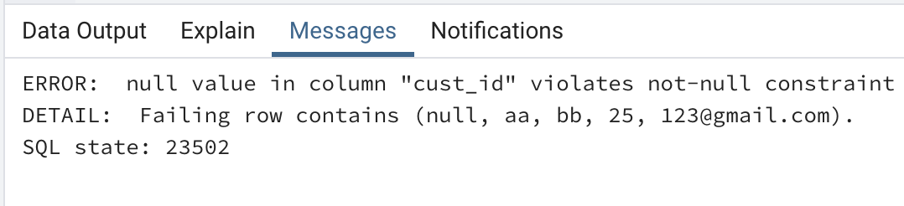

[範例1.8](./alter_table.sql)：`DROP NOT NULL` 取消對欄位名稱  `cust_id` 設定的限制條件`NOT NULL`。執行執行成功後再重新執行一次 範例1.7 的SQL 語句即可完成新增
- `CHECK`： 用來限制欄位中可用的值，確保該欄位中的值都會符合設定的條件

[範例1.9](./alter_table.sql): `ADD constraint` ... `CHECK`; 限制 `customer_table` 資料表中的 `cust_id` 欄位值都**必需要大於 0**
[範例2.1](./alter_table.sql): 對 範例1.9 的設定條件做測試，會回傳錯誤提示`new row for relation "customer_table" violates check constraint "cust_id"`
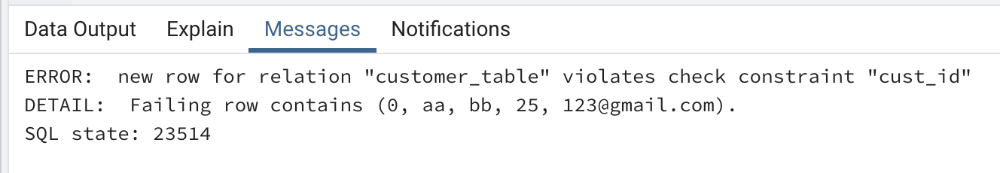

[範例2.2](./alter_table.sql): 移除 範例1.9 設定的限制
- `UNIQUE`
- `PRIMARY KEY`：設定`PRIMARY KEY (主鍵)` 的欄位確保在資料表中的唯一性，`PRIMARY KEY`欄位中的每一筆資料在資料表中都必需是**唯一**

[範例2.3](./alter_table.sql): 將 `cust_id` 設為`RIMARY KEY`
- `FOREIGN KEY`: `FOREIGN KEY(外鍵)`為一個 (or 多個) 指向其它資料表中主鍵的欄位，欄位限制的值只能是源自另一張資料表的主鍵。
語法結構:
```sql
ALTER TABLE <table_name>
ADD FOREIGN KEY <foreign_key_name> REFERENCES <table_name>(<primary_key_name>);
```
- `DEFAULT`： 用來設定欄位的預設值


### 注意 ： 
若欄位中已經 **存在/不存在** 被 **Add/Drop** 的欄位名稱，系統會跳出錯誤提示，若要避免引發錯誤，可在 SQL 敘述中後面加上 `IF EXISTS` 
Sample:
```sql
ALTER TABLE customer_table DROP column IF EXISTS test_col ;
```

# SQL Functions
SQL 有幾種重要的內建函數。範例資料源: [Sales](./Data/Sales.csv)、[Customer](./Data/Customer.csv)
## Aggregate Functions
為聚合函數，其中包括
### COUNT()
`COUNT()`: 計算與查詢條件相符的資料共有幾筆。
#### 語法結構:
```sql
select COUNT(<column_name>) from <table_name>;
```
- [範例1.1](./aggregate.sql): 計算資料表 Sales 內共有幾筆資料
- [範例1.2](./aggregate.sql): 找出資料表 Sales 內的客戶 ID 為 **CG-12520** ，計算 **order_line** 及不相同的**order_id**兩個欄位的資料筆數，並給予別名

### SUM()
計算一數值欄位的總和
#### 語法結構:
```sql
select SUM(<column_name>) from <table_name>;
```
- [範例2.1](./aggregate.sql): 資料表 Sales 內 Profit 欄位的所有資料進行加總
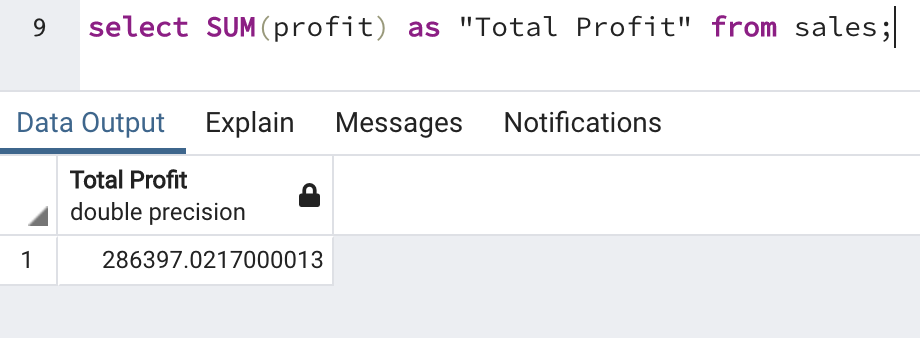
- [範例2.2](./aggregate.sql): 選出資料表 Sales 內所有 
product_id 為 **FUR-CH-10000454**的資料， 對 **quantity** 欄位進行加總

### AVG()
計算某個欄位的平均值
#### 語法結構:
```sql
select AVG(<column_name>) from <table_name>;
```
- [範例3.1](./aggregate.sql): 計算資料表 Customer 內的客戶平均年齡
- [範例3.2](./aggregate.sql): 可以`AVG()`函數內做乘除

### MIN() & MAX()
取得特定欄位中的最小值&最大值
#### 語法結構:
```sql
select MIN(<column_name>) from <table_name>;
select MAX(<column_name>) from <table_name>;
```
- [範例4.1](./aggregate.sql): 找出資料表 Sales 內的2015年6月的最低銷售額，可執行下方指令查詢 sales 欄位的所有值，並依小到大排序來檢查。
```sql
select sales as "Minimum sales in June 2015" from sales where order_date between '2015-06-01' and '2015-06-30' order by sales;
```
- [範例4.2](./aggregate.sql): 找出資料表 Sales 內的2015年6月的最低銷售額，可執行下方指令查詢 sales 欄位的所有值，並依小到大排序來檢查。
```sql
select sales as "Minimum sales in June 2015" from sales where order_date between '2015-06-01' and '2015-06-30' order by sales desc;
```

## String Functions
字串函數
### LENGTH()
取得字串長度
#### 語法結構:
```sql
SELECT LENGTH(<column_name>) FROM <table_name>;
```
- [範例1.1](./string_function.sql): 計算顧客名字的長度
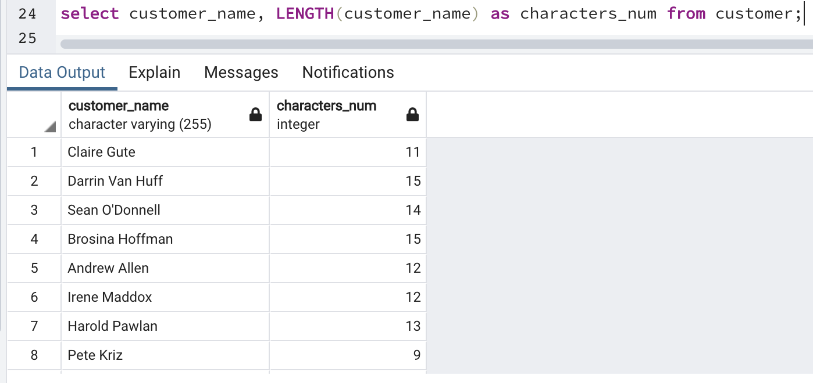

###  UPPER() & LOWER()
將英文字母轉換為大寫 & 小寫
```sql
SELECT UPPER(<column_name>) FROM <table_name>;
SELECT LOWER(<column_name>) FROM <table_name>;
```
- [範例2.1](./string_function.sql): 轉換顧客名字為全大寫及全小寫

### REPLACE()
以新字串取代原字串內容。
>  **注意：**  REPLACE() 是大小寫敏感的

#### 語法結構:
```sql
SELECT REPLACE(str, from_str, to_str) FROM <table_name>;
```
- [範例3.1](./string_function.sql): 篩選出國家為美國的顧客，並將國家名稱替換成縮寫

### TRIM(), RTRIM(), LTRIM()
用於刪除字串的字首 (leading) 或字尾 (trailing) 的空白字元 (whitespace)
#### 語法結構:
```sql
TRIM( [{ LEADING | TRAILING | BOTH }] [ trim_character ] FROM string)

TRIM( [remstr FROM] string )

RTRIM( string, trim_character )

LTRIM( string, trim_character )
```
- [範例4.1](./string_function.sql): 刪除文字左方的空格，同範例 4.5
.png)
- [範例4.2](./string_function.sql): 刪除文字右方的空格，同範例 4.4
- [範例4.3](./string_function.sql): 刪除文字兩邊的空格

### CONCAT
合併多個欄位的值
#### 語法結構:
```sql
string1 ||  string2 || stringN.... ;
```
- [範例5.1](./string_function.sql): 將 city, state, country  合併成新的欄位名稱 address
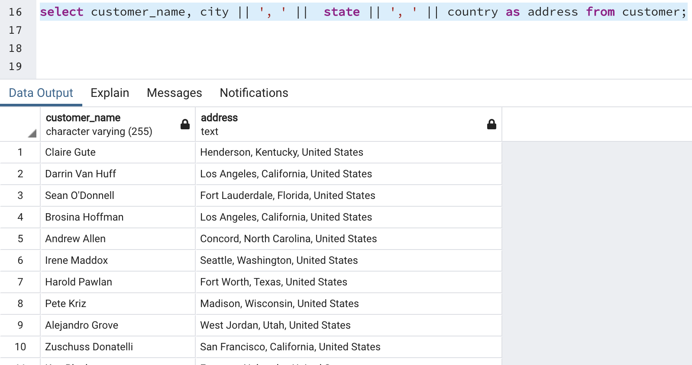

###  SUBSTRING()
取出特定的字串
#### 語法結構:
```sql
SUBSTRING( string [ from start_position ] [for length ] );
```
`start_position`: 表初始位置，若不填，則預設為**1**
`length`: 取出的長度
- [範例6.1](./string_function.sql): 取出 **customer_id** 前兩個字為 **AB** 的資料，並提取 **customer_id** 前兩個字為新欄位 **customer_num** 的資料
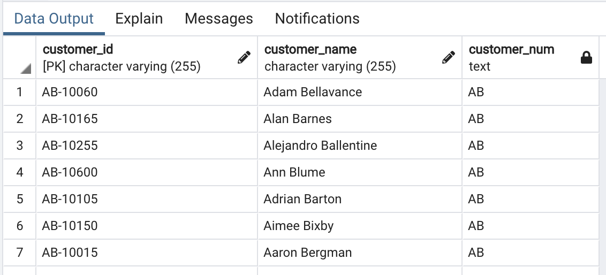
- [範例6.2](./string_function.sql): 取出 **customer_id** 前兩個字為 **AB** 的資料，並提取 **customer_id** `第4個`字開始，`長度為五`的字串，為新欄位 **customer_num** 的資料，可與範例 6.1 做對比
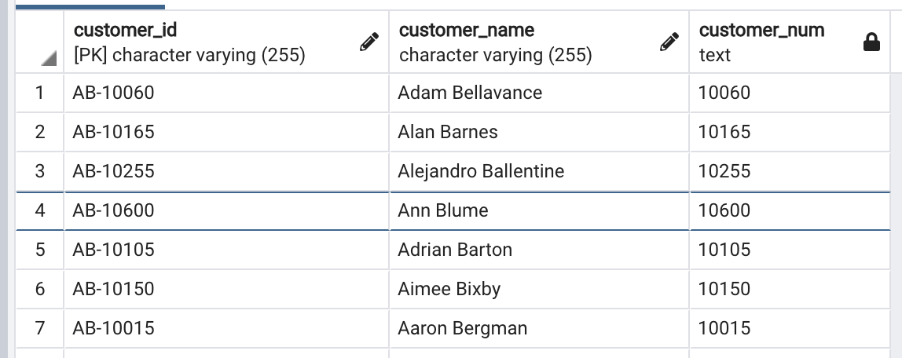
### string_agg()
直接把表達式變字串
#### 語法結構:
```sql
string_agg(expression, delimiter);
```
- [範例7.1](./string_function.sql): 情境：同一筆訂單下可能包含不同的商品，若要查詢同一個訂單下的所有商品，並將其合併起來，變成新的欄位。
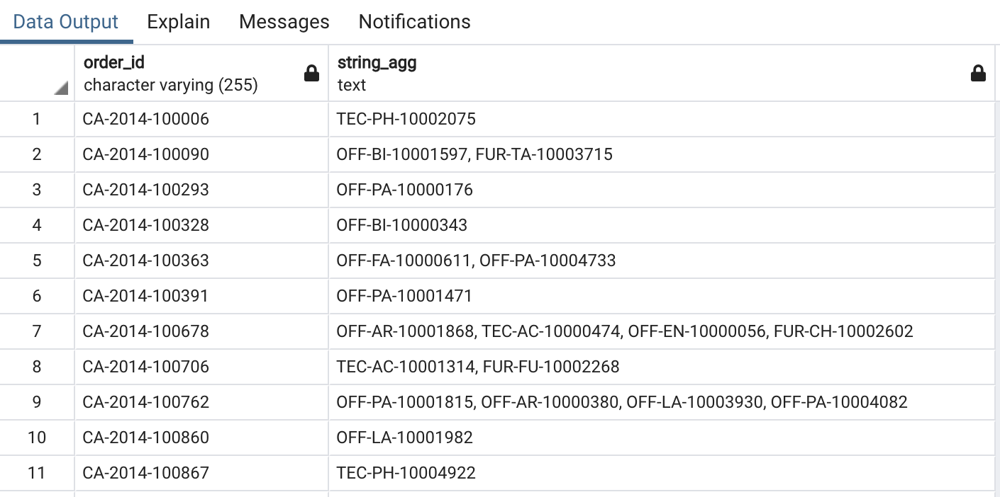

## Mathematical Functions
數值函數


# 其他
## Group by
搭配聚合函數 (Aggregate Functions)。
> 使用時機: 篩選不只一個欄位，其中至少一個欄位有包含函數的運用時，就需要用到 `GROUP BY`。

即除了包括函數的欄位外，都需要將其放在 GROUP BY 的子句中。
### 語法結構:
```sql
SELECT column_names, agg_function(column_name)
FROM table_name
GROUP BY column_names
```
> column_name 可以多個，不過 GROUP BY 子句後面就要填相對應得column_name

e.g. 
```sql
SELECT column_name1, column_name2, column_name3, agg_function(column_name) FROM table_name GROUP BY column_name1, column_name2, column_name3
```
- [範例1.1](./groupby.sql): 查詢客戶的所在區域及計算各區域的顧客數量
- [範例1.2](./groupby.sql): 查詢各個產品的銷售數量
- [範例1.3](./groupby.sql): 查詢各個客戶的消費總額、平均消費額、最低(高)消費額

## Having
由於 `WHERE` 子句無法對聚合函數做條件限制，所以需要 `HAVING` 對 **聚合函數 (Aggregate)** 做條件查詢
```sql
SELECT column_names, agg_function(column_name)
FROM table_name
[WHERE Conditions]
GROUP BY column_names
HAVING agg_function(column_name) ;
```
> [WHERE Condition] 為非必要的條件

- [範例1.1](./having.sql): 找出客戶數量大於200的地區
- [範例1.2](./having.sql): 找出客戶數量大於100，且年齡大於40歲的地區

## CASE 
用於邏輯判斷，類似 if/then/else 條件判斷
### 語法結構:
```sql
CASE
  WHEN condition THEN result
  [WHEN···]
  [ELSE result]
END;
```
or
```sql
CASE expression
  WHEN value THEN result
  [WHEN···]
  [ELSE result]
END;
```
- [範例1.1](./case.sql): 新增欄位，設置條件判斷顧客年齡位於哪個區間範圍


## JOIN
`JOIN` 又作合併查詢。因資料庫的設計方式，會將原始資料拆成多張表，再透過外鍵進行關聯，若想查詢儲存在不同資料表的欄位資料，就需透過 JOIN 整合多張表，組成一張作為查詢用途的暫時性資料表，不影響原始資料表的結構及資料。

JOIN 的種類:
### INNER JOIN 內部合併查詢

如上圖可知，`INNER JOIN` 為在兩張表之間取**交集**，只會合併Table A 和 Table B 中能夠**匹配到的 row**，其他 row 都不會被保留下來。
#### 語法結構:
```sql
SELECT tableA.column1, tableB.column2...
FROM tableA
INNER JOIN tableB
ON tableA.pk_a=tableB.fk_a;
```
上述語法結構，tableA 為**主要Table**，相同名稱的欄位透過 table_name.column 這種寫法來做區分，若無重複的欄位名稱時可不用。

- [範例1.1](./join.sql): 取出 sales 表中的 `order_line`, `product_id`, `customer_id`, `sale`，以及 customer 表中的 `customer_name`, `age`。 PostgreSQL 會先搜尋  TableB 來是否有 row 符合 `a.customer_id=b.customer_id`。 如果找到的話，它會合併這倆 row 中的 columns。
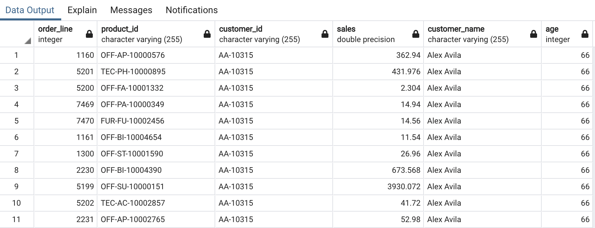

### LEFT (OUTER) JOIN 左(外部)合併查詢
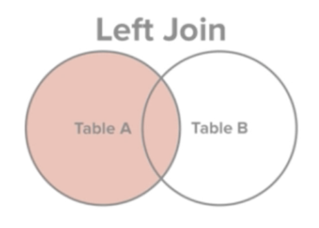
如上圖可知，`LEFT JOIN` 是取 Table A (左) 的所有資料，即便Table B (右)中的共同欄位沒有符合的值也一樣會被取出。
#### 語法結構:
```sql
SELECT tableA.column1, tableB.column2...
FROM tableA
LEFT [OUTER] JOIN tableB 
ON tableA.pk_a = tableB.fk_a;
```
其中`[OUTER]`可省略。
- [範例2.1](./join.sql): 將[範例1.1](./join.sql) 改為`LEFT  JOIN`

### RIGHT (OUTER) JOIN 右(外部)合併查詢

如上圖可知，`RIGHT JOIN` 是取 Table B (右) 的所有資料，即便Table A (左)中的共同欄位沒有符合的值也一樣會被取出。
#### 語法結構:
```sql
SELECT tableA.column1, tableB.column2...
FROM tableA
RIGHT [OUTER] JOIN tableB 
ON tableA.pk_a = tableB.fk_a;
```
其中`[OUTER]`可省略。
- [範例3.1](./join.sql): 將[範例2.1](./join.sql) 改為`RIGHT  JOIN`

### FULL (OUTER) JOIN 完全(外部)合併查詢
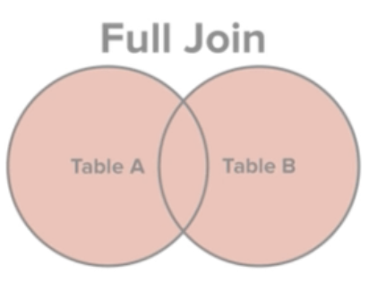
如上圖可知，`FULL JOIN` 是取 Table A 、 Table B  的所有資料，即便兩者共同欄位沒有符合的值也一樣會被取出。
#### 語法結構:
```sql
SELECT tableA.column1, tableB.column2...
FROM tableA
FULL [OUTER] JOIN tableB 
ON tableA.pk_a = tableB.fk_a;
```
其中`[OUTER]`可省略。
- [範例4.1](./join.sql): 將[範例3.1](./join.sql) 改為`FULL  JOIN`

### CROSS JOIN 交叉合併查詢
將兩張資料表中所有的可能組合列出來，不必指定任何條件。
> 注意： 當有 **WHERE、ON、USING** 條件時不建議使用 `CROSS JOIN`

#### 語法結構:
```sql
SELECT tableA.column1, tableB.column2...
FROM tableA, tableB...;
```
- [範例5.1](./join.sql)

### EXCEPT 差集
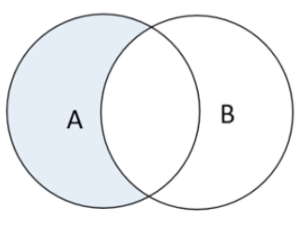
為取 Table A 、 Table B 之**差集**
#### 語法結構:
```sql
SELECT column1, column2...
FROM tableA
[WHERE Conditions]
EXCEPT
SELECT column1, column2...
FROM tableB
[WHERE Conditions];
```
- [範例6.1](./join.sql)

### UNION
將兩個以上(包含兩個) SQL 查詢的結果合併成一個，而且只會**回傳不同值的資料**，類似`DISTINCT`。
> 使用時機：
>通常是有兩個結構很相似的 table，但並沒有完全一樣

**注意：**
1. 兩個 查詢語句 回傳的欄位需要是**相同的資料型別及數量**（數量必須相同但欄位的值不須一定相同）。
2. `UNION` 會把所有重複的 rows 移除，除非使用的是 UNION ALL。

#### 語法結構:
```sql
SELECT column1, column2...
FROM tableA
[WHERE Conditions]
UNION
SELECT column1, column2...
FROM tableB
[WHERE Conditions];
```
- [範例7.1](./join.sql)

# Convertion Functions
## Numbers / Date => String

## String => Numbers / Date


